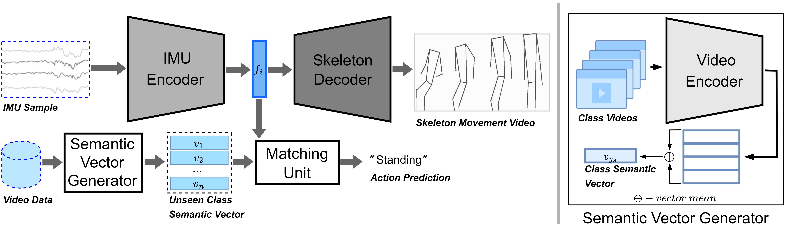

# SEZ-HARN: Self-Explainable Zero-shot Human Activity Recognition Network

## Abstract

Human Activity Recognition (HAR) using data from Inertial Measurement Unit (IMU) sensors has many practical applications in healthcare and assisted living environments. However, its use in real-world scenarios has been limited by the lack of comprehensive IMU-based HAR datasets that cover a wide range of activities and the lack of transparency in existing models. Zero-shot HAR (ZS-HAR) overcomes the data limitations, but current models struggle to explain their decisions, making them less transparent. This paper introduces a novel IMU-based ZS-HAR model called the Self-Explainable Zero-shot Human Activity Recognition Network (SEZ-HARN). It can recognize activities not encountered during training and provide skeleton videos to explain its decision-making process. Experiment results on four benchmark datasets (PAMAP2, DaLiAc, UTD-MHAD, and MHEALTH) show that SEZ-HARN produces realistic and understandable explanations while outperforming other black ZS-HAR models in Zero-shot prediction accuracy.

## Overview of TEZARNET Training Phase



## Preparation 
> clone the code base

> setup libraries 
    `python -m pip install requirements.txt`
> setup Git LFS
    `git lfs install`
    `git lfs track`
> download imu datasets
    1. download datasets directly from the repo 
    2. download datasets from original source
> download video datasets
    corresponding video datasets are [link](https://drive.google.com/drive/folders/1EWiKZ4HLTHAeeKd_Ej4N04gPuThtA8Ph?usp=sharing_eil_m&ts=649fb7cd) in here.
## Execution 
### Training 
* for PAMAP2 dataset with default configs
    `python main.py --IMU_data_path ./data_path --I3D_data_path ./data_path`
* for DaLiAc dataset
    `python main.py --IMU_data_path ./data_path --I3D_data_path ./data_path --datasets daliac --d_model 224`
    
## Citation 
```
<In review>
```
